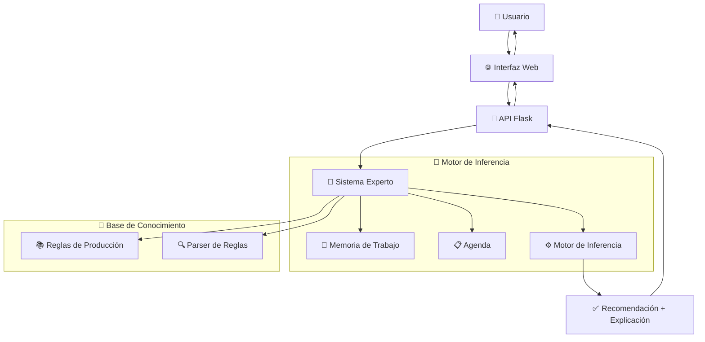

# 🌿 PlantAdvisor TDF: Sistema Experto de Flora Fueguina

<div align="center">


### 🎓 *Sistema Experto Académico para la Recomendación de Plantas en Tierra del Fuego*

**Una implementación académicamente rigurosa inspirada en MYCIN/DENDRAL**

[🎬 **Ver Demo en YouTube**](https://youtu.be/vT_oZjAJOHk) • [📚 **Documentación**](docs/ARQUITECTURA.md) • [🚀 **Demo Online**](#-uso-rápido)

</div>

---

## 🌟 **Descripción del Proyecto**

**PlantAdvisor TDF** es un sistema experto clásico basado en reglas que aplica **inteligencia artificial simbólica** para recomendar plantas nativas y adaptadas a las condiciones climáticas únicas de **Tierra del Fuego, Argentina**.

### 🎯 **Problemática Abordada**
Tierra del Fuego presenta desafíos únicos para el cultivo:
- 🌪️ **Vientos patagónicos extremos**
- ❄️ **Temperaturas bajo cero**
- 🔥 **Calefacción que genera sequedad extrema**
- 🌱 **Flora nativa poco conocida**

### 💡 **Solución Técnica**
Sistema experto que combina:
- **Forward Chaining** para inferencia
- **Reglas de Producción** SI-ENTONCES
- **Base de Conocimiento** con 20+ reglas expertas
- **Conflict Resolution** académico
- **Explicabilidad** completa del razonamiento

---

## 🏛️ **Arquitectura del Sistema**

<div align="center">



</div>

### 🔧 **Componentes Principales**

| Componente | Función | Tecnología |
|------------|---------|------------|
| 🧠 **Motor de Inferencia** | Ejecuta ciclo Match-Conflict-Act | Python OOP |
| 📝 **Memoria de Trabajo** | Gestiona hechos iniciales y derivados | Estructuras de datos |
| 📋 **Agenda** | Conflict Resolution con prioridades | Algoritmos de ordenamiento |
| 📚 **Base de Conocimiento** | 20+ reglas expertas de botánica TDF | Reglas declarativas |
| 🔍 **Parser de Reglas** | Evaluación dinámica de condiciones | Evaluación simbólica |
| 🌐 **API Web** | Interfaz REST para integración | Flask + CORS |

---

## 🚀 **Instalación Rápida**

### 📋 **Prerrequisitos**
- 🐍 Python 3.8+
- 📦 pip (gestor de paquetes)

### ⚡ **Instalación en 3 pasos**

```bash
# 1️⃣ Clonar el repositorio
git clone https://github.com/tu-usuario/plantadvisor-tdf.git
cd plantadvisor-tdf

# 2️⃣ Crear entorno virtual (recomendado)
python -m venv venv
source venv/bin/activate  # Linux/Mac
# venv\Scripts\activate     # Windows

# 3️⃣ Instalar dependencias
pip install -r requirements.txt
```

---

## 🎮 **Uso del Sistema**

### 🌐 **Modo Web (Recomendado)**

```bash
python run_web.py
```

Luego abre tu navegador en: **http://127.0.0.1:5000**

<div align="center">


</div>

### 🖥️ **Modo Consola (Debugging)**

```bash
python src/main.py
```

### 📡 **API REST**

```bash
# Endpoint principal
POST /api/consulta
Content-Type: application/json

{
  "ubicacion_usuario": "interior",
  "calefaccion_nivel": "alta", 
  "mascotas_presentes": false,
  "experiencia_usuario": "principiante",
  "iluminacion_disponible": "media"
}
```

---

## 🧠 **Base de Conocimiento Experta**

### 🌱 **Plantas Implementadas (20+ especies)**

<details>
<summary>🏠 <strong>Plantas de Interior</strong></summary>

- 🛡️ **Sansevieria** - Resistente a sequedad extrema
- 🌿 **Potus** - Ideal para poca luz
- 🌺 **Cactus de Navidad** - Floración invernal
- 🍃 **Lazo de Amor** - Muy adaptable
- ✨ **Monstera Deliciosa** - Decorativa premium
</details>

<details>
<summary>🌳 <strong>Plantas de Exterior</strong></summary>

- 🔥 **Notro / Ciruelillo** - Flores rojas espectaculares
- 🛡️ **Calafate** - Arbusto nativo resistente
- 🌑 **Mata Negra** - Extrema resistencia al viento
- 🍂 **Ñire** - Colores otoñales únicos
- 🌲 **Lengas** - Árbol emblemático patagónico
</details>

### 🔬 **Reglas Expertas Implementadas**

| ID | Tipo | Descripción | Expertise |
|----|------|-------------|-----------|
| R001 | 🌡️ Diagnóstico | Detecta ambiente seco por calefacción | Condiciones TDF |
| R002 | 🌿 Recomendación | Sansevieria para ambientes secos | Interior resistente |
| R005 | 🌺 Especializada | Notro para flores en exterior | Flora nativa |
| R011 | 🌱 Principiantes | Mata Negra para sol directo | Bajo mantenimiento |
| ... | ... | ... | ... |

---

## 🎬 **Video Demostración**

<div align="center">

[](https://youtu.be/vT_oZjAJOHk)

**🎯 Contenido del Video (7 minutos):**
1. 🌍 Problemática de Tierra del Fuego
2. 🏛️ Arquitectura académica del sistema
3. 🎮 Demostración en vivo
4. 🧠 Explicación del razonamiento

</div>

---

## 📁 **Estructura del Proyecto**

```
plantadvisor-tdf/
├── 📂 src/
│   ├── 🧠 core/                 # Motor de inferencia
│   │   ├── motor_inferencia.py  # Ciclo Match-Conflict-Act
│   │   ├── memoria_trabajo.py   # Gestión de hechos
│   │   ├── agenda.py           # Conflict Resolution
│   │   └── sintaxis_reglas.py  # Definición de reglas
│   ├── 📚 knowledge/           # Base de conocimiento
│   │   ├── base_conocimiento.py # Reglas expertas TDF
│   │   └── parser_reglas.py    # Evaluación dinámica
│   ├── 🌐 web/                 # Interfaz web
│   │   ├── api.py              # API REST Flask
│   │   ├── templates/          # HTML templates
│   │   └── static/             # CSS, JS, imágenes
│   ├── main.py                 # Demo consola
│   └── sistema_experto.py      # Integración completa
├── 📖 docs/
│   └── ARQUITECTURA.md         # Documentación técnica
├── 🚀 run_web.py              # Launcher web
├── 📋 requirements.txt         # Dependencias
└── 📄 README.md               # Este archivo
```

---

## 🔬 **Características Técnicas**

### ✨ **Funcionalidades Principales**
- ✅ **Forward Chaining** clásico
- ✅ **Conflict Resolution** con 5 estrategias
- ✅ **Explicabilidad** completa (trace del razonamiento)
- ✅ **Separación conocimiento/inferencia**
- ✅ **API REST** para integración
- ✅ **Interfaz web** responsiva
- ✅ **Base de conocimiento** modular y extensible

### 🎯 **Validación Académica**
- ✅ Arquitectura inspirada en **MYCIN/DENDRAL**
- ✅ **Reglas de producción** declarativas auténticas
- ✅ **Motor independiente** del dominio
- ✅ **Capacidades de explicación** académicas
- ✅ **Forward chaining** académicamente validado

---

## 🤝 **Contribución**

¡Las contribuciones son bienvenidas! 

### 📝 **Cómo contribuir:**

1. 🍴 Fork el proyecto
2. 🌿 Crea una rama para tu feature (`git checkout -b feature/nueva-planta`)
3. 💾 Commit tus cambios (`git commit -m 'Agregar nueva planta nativa'`)
4. 📤 Push a la rama (`git push origin feature/nueva-planta`)
5. 🔀 Abre un Pull Request

### 🌱 **Áreas de contribución:**
- 🌿 **Nuevas plantas** nativas de TDF
- 🔬 **Reglas expertas** adicionales
- 🌐 **Mejoras de interfaz** web
- 📚 **Documentación** y tutoriales
- 🧪 **Tests automatizados**

---

## 📄 **Licencia**

Este proyecto está bajo la licencia **MIT**. Ver archivo `LICENSE` para más detalles.

---

## 📞 **Contacto**

<div align="center">

**👨‍💻 Desarrollado como proyecto académico para Sistemas de IA**

📧 **Email:** Schvartz.g@gmail.com  
🐙 **GitHub:** https://github.com/Zayitus/PLantAdvisor_V4
🎥 **Video:** [Ver en YouTube](https://youtu.be/vT_oZjAJOHk)

---

⭐ **¡Dale una estrella si te gustó el proyecto!** ⭐

</div>

---

<div align="center">

### 🌿 *"Conectando la sabiduría botánica ancestral con la inteligencia artificial moderna"*


</div>